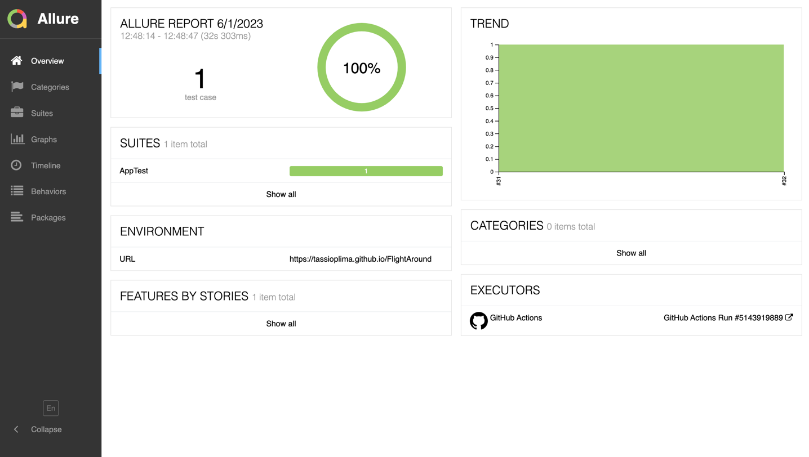

# Automation Project

Automation project with Java + Gradle on Browser Stack (Device Farm) and GitHub Action (CI) doing the remote mobile test, GithubPages to deploy Allure Serve to see test results, PageObject/Screen and PageFactory as a structure. 

[](https://github.com/tassioplima/cocus/actions)
[](https://tassioplima.github.io/automation-ci/)

Configuration: 

- Java JDK 8 or 11
- Android SDK updated
- Android Emulator
- Appium Server
- Browser Stack Account and Keys

Running:

``` sh
./gradlew test --tests "AppTest"
```

You can run with different devices like iOS and Android using properties when running this command line:

Android: 

``` sh
./gradlew test --tests "AppTest" -DMOBILE=ANDROID
```

iOS: 

``` sh
./gradlew test --tests "AppTest" -DMOBILE=iOS
```

We have 3 possibilities for execution the tests locally, remotely or via device farm, setting the variable RUN to, local, remote or farm.

local = execute locally on physical devices.
remote = execute using variables from the GitHub Action, recommended for CI executions.
farm =  you can execute setting some variables on remote.json and execute from you own computer to a device farm.

Running on CI:

``` sh
./gradlew test --tests "AppTest" -DMOBILE=android -DRUN=remote
```

Running locally:

``` sh
./gradlew test --tests "AppTest" -DMOBILE=android -DRUN=local
```

Running on device farm:

``` sh
./gradlew test --tests "AppTest" -DMOBILE=android -DRUN=farm
```

### Building Allure report 

To build a report, and browse it use the following command:

``` sh
./gradlew allureServe
```

Github Pages with Allure report results: [ALLURE](https://tassioplima.github.io/miniSDK/)


